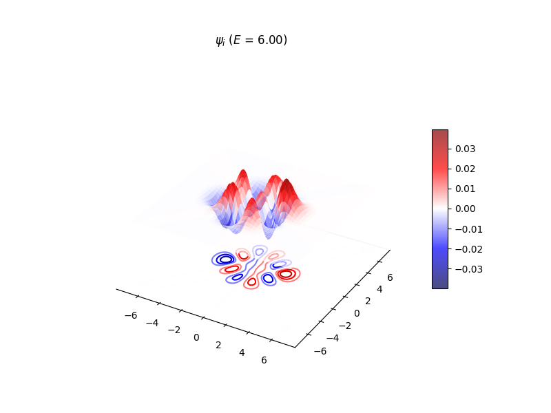

# NDDVR

A python module for solving the TISE using discrete-variable representation.



### Features

- Solve ND problems using CM-DVR.
- Solve ND problems for DVR type algorithms learned from program synthesis (`synthesised_algorithms.py`).
- Contains the AMMPOT4 NH3 and Partridge-Schwenke H2O potential.
- Contains routines for generating grids in normal and cartesian coordinates, as well as transforming between.
- Generate uniform direct product grids, or quasi-random Sobol grids for use in training ML potentials on fewer points.


### Installation

Install requires `numpy ~= 1.26` for f2py compilation of FORTRAN routines.

To install:

```
> git clone https://github.com/KyleAcheson/NDDVR.git
> cd NDDVR
> pip install .
```

This will install all source files in the default location for your setup as `/path/fast_dvr/`, using venvs is recommended.

Import as:

```
import fast_dvr

```
