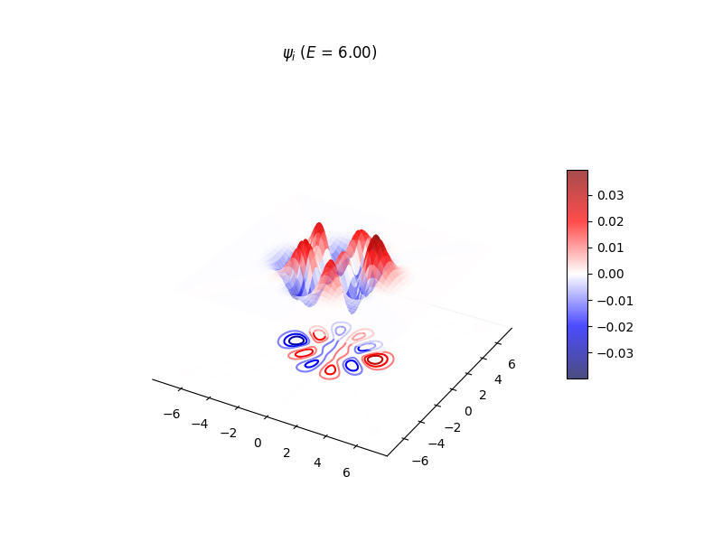

# NDDVR

A python module for solving the TISE using discrete-variable representation.



### Features

- Solve ND problems using sine-DVR and CM-DVR
- Solve ND problems using DVR type algorithms learned from program synthesis (`synthesised_algorithms.py`).
- Contains the AMMPOT4 NH3 and Partridge-Schwenke H2O potential.
- Contains routines for generating grids in normal and cartesian coordinates, as well as transforming between.
- Contains routines for diagonalising the position operator to construct a DVR (HEG procedure for diagonalisation DVR).
- Generate uniform direct product grids, or quasi-random Sobol grids for use in training ML potentials on fewer points.
- Solve ND DVR problems using iterative eigensolvers and sparse matrices, making use of tensor transformations to reduce computations.


### Installation

Install requires `numpy ~= 1.26` for f2py compilation of FORTRAN routines.

To install:

```
> git clone https://github.com/KyleAcheson/NDDVR.git
> cd NDDVR
> pip install .
```

This will install all source files in the default location for your setup as `/path/fast_dvr/`, using venvs is recommended.

Import as:

```
import fast_dvr

```

### Main usage:

The main interface to perform multi-dimensional calculations is contained in the Calculators class, different solvers can be requested from the `exact_solvers` module.
Several primative example potentials can also be constructed from the `potentials` module. 

Basic example:
```
import fast_dvr.potentials as potentials
import fast_dvr.synthesised_solvers as solvers
import fast_dvr.dvr as dvr
import fast_dvr.wf_utils as wfu

neig = 3
masses = [1, 1, 1] # mass-weighted normal coordinates
ndims = 3
x = np.linspace(-5, 5, 21)
y = np.linspace(-5, 5, 21)
z = np.linspace(-5, 5, 21)
grids = [x, y, z]
v = np.zeros(21*3) # this must be 1D

i = 0
for xi in x:
    for yi in y:
        for zi in z:
            v[i] = potentials.harmonic_potential_3d(xi, yi, zi) # just an example potential
            i +=1

calculator =  dvr.Calculator(solvers.algorithm_116, use_operators=True) # This uses an iterative eigensolver and computes the full matrix from a series of tensor index transformations.
energies, wfs = caluclator.solve_nd(grids, masses, v, neig, ndims=ndims)
energies, wfs = wfu.evaluate_energies(wfs, grids, v, masses, ndim=ndims, normalise=True) # this line is required if using one of the PS algorithms as energies are computed as wf expectation values.

```

For more involved examples on actual molecules, see the examples directory.
Note it the responsibility of users to ensure their coordinate axes and potentials are in the correct form.
